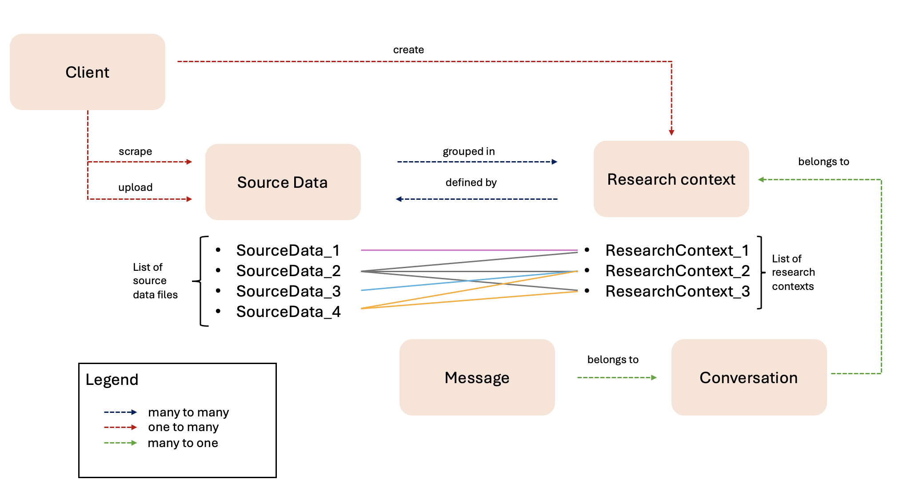

# Introduction to the Planckster Ecosystem

This guide aims to familiarize you with the fundamental concepts of the Satellite Data Augmentation (SDA) system. It will help you understand the essential components, their functions, and how they interrelate. By following this guide, you'll gain the necessary knowledge to navigate the program, use it efficiently, and maximize its benefits.

This guide covers five key concepts:

1. Client
2. Source Data
3. Research Context
4. Conversation
5. Message

The guide is organized into three sections. The first section provides an in-depth explanation of each concept. The second section includes a diagram illustrating the interactions between these concepts, which underpin the functionality of the SDA system. The final section offers a glossary with concise definitions of each concept.

## SDA key concepts

### Client

The term "client" refers to the user of the SDA system. It serves as a unique identifier for logging into the SDA platform. Similar to other programs, a user must create an account, here referred to as a "client," with a username and password to access and utilize the system.

For the current testing phase, the SDA system will operate with a single client account named "sda," which will be used by all users needing access. The password for this account will be predefined.

| Name of the attribute   | Type    | Description |
|-------------------------|---------|--------------------------------------------------------------------------------------|
| `id`                    | integer | A unique identifier automatically generated by the program when a client is created. |
| `sub`                   | string  | A unique name defined by the client.[^1] |

[^1]: In this version, the name for the sole existing client has already been set as "sda".

In future iterations, the system will support the creation of multiple client accounts for different users. A client could either be a person or an automated bot designed to request information.

### Source Data

"Source data" refers to the various pieces of information stored within the SDA system. This data can originate from two sources: 1) data collected by a scraper executed by the client, or 2) data uploaded directly by the client.

Regardless of how the data is acquired, it will be stored in the client's account or profile. As a result, only the client can view, access, and utilize this data after logging in. In future updates, a permission feature will be introduced, allowing clients to share source data with other users.

| Name of the attribute | Type   | Description                                                                                                                                                                |
|-----------------------|--------|-----------------------------------------------------------------------------------------------------------------------|
| `id`                    | integer | A unique identifier automatically assigned by the program when source data is either scraped or uploaded.  |
| `name`                  | string | The name of the source data. If the data is scraped, the program assigns the name automatically. If the data is uploaded, the client must provide a name.  |
| `relative_path`         | string | The file path of the source data. It is automatically generated based on specific inputs provided by the client.[^2]    |
| `type`                  | string | The file type of the source data (e.g., .txt, .csv, .pdf, .jpg).    |
| `protocol`              | enum   | The protocol used for saving the source data file. The default is "s3".  |
| `status`                | enum   | Indicates the availability of the data with two possible values:  i) "available": The data is available for use.  ii) "unavailable": The data is not available for use.[^3] |

[^2]: In this version, Minio is used to store data. While the storage solution may change in the future, the relative path will remain consistent. Refer to the Kubeflow notebooks guide for more information.
[^3]: Data may become unavailable due to issues such as a crash in Minio.

### Research Context

A "Research Context" is a collection of source data files organized by the client. Its main purpose is to help clients categorize and manage their data within their accounts. For example, a client might create research contexts based on geographical regions or types of natural disasters, grouping data accordingly.

Research contexts and source data are not hierarchical; they have a many-to-many relationship. This means a single research context can include multiple source data files, and a single source data file can be associated with multiple research contexts.

Clients have the flexibility to group source data as they see fit and create multiple research contexts. Only the client who creates a research context can view and access it by logging in with their account. It's important to note that research contexts are immutable; once created, they cannot be modified, only deleted. Therefore, careful consideration is advised before creating them.

| Name of the attribute | Type    | Description                                                                                     |
|-----------------------|---------|-------------------------------------------------------------------------------------------------|
| `id`                    | integer | A unique identifier automatically assigned by the program when the research context is created. |
| `title`                 | string  | The name of the research context, assigned by the client.                                       |
| `description`           | string  | A brief description of the contents and purpose of the research context, provided by the client.|
| `source_data`           | list    | A list of source data files that comprise the research context, specified by the client.        |

### Conversation

A "Conversation" is a chat session initiated within the framework of a specific research context. It enables clients to interact with and query the data contained in that research context. Through conversations, clients can request specific information from the data and perform various operations. For example, within a wildfire research context, a client might start a conversation to ask for the dates of particular wildfire events.

Conversations are structured like chat interactions, consisting of messages either sent by the client or generated by the SDA system in response. The conversation can only access and utilize the source data included in the research context it was created under.

| Name of the attribute | Type    | Description                                                                                     |
|-----------------------|---------|-------------------------------------------------------------------------------------------------|
| `id`                    | integer | A unique identifier automatically assigned by the program when the conversation is created.     |
| `title`                 | string  | The title or name of the conversation, which is provided by the client.                         |

### Message

A "Message" is a textual element within a conversation. It can either be a communication sent by the client, known as a user message, or a response generated by the system, referred to as an agent message. Messages are the fundamental units of interaction within a conversation, facilitating the exchange of information between the client and the SDA system.

| Name of the attribute | Type    | Description                                                                                             |
|-----------------------|---------|---------------------------------------------------------------------------------------------------------|
| `id`                    | integer | A unique identifier for the message, assigned by the program when the message is created.               |
| `content`               | string  | The content of the message. This is defined by the client for user messages and by the SDA system for agent messages. |
| `type`                  | enum    | The type of message, which can be one of the following:  i) usermessage: If the message is created by the client.  ii) agentmessage: If the message is a response from the SDA system. |
| `timestamp`             | datetime| The time at which the message is created, automatically recorded by the program at the moment of creation. |

## Diagram

The following diagram illustrates the relationships between the various concepts described:

1. **Client**: At the top of the hierarchy is the client, who can either scrape or upload source data and create research contexts defined by sets of source data. The client maintains a one-to-many relationship with both source data and research contexts. This means that a single client can generate multiple source data files and research contexts, which are only accessible to that client.

2. **Source Data and Research Context**: There is a many-to-many relationship between source data and research contexts. A research context can include multiple source data files, and a single source data file can be associated with to multiple research contexts.

3. **Research Context and Conversation**: Within each research context, there can be multiple conversations. The relationship between a research context and its conversations is many-to-one, meaning that each conversation belongs to one research context, but a research context can have multiple conversations.

4. **Conversation and Messages**: Each conversation contains multiple messages. The relationship between messages and a conversation is also many-to-one, indicating that each message belongs to a single conversation.

## Glossary

| Term               | Definition                                                                                                          |
|--------------------|----------------------------------------------------------------------------------------------------------------------|
| **Client**        | Refers to the user of the SDA system. It serves as a unique identifier for logging into the SDA platform.            |
| **Source Data**  | Refers to the various pieces of information stored within the SDA system. This data can originate from two sources: 1) data collected by a scraper executed by the client, or 2) data uploaded directly by the client. |
| **Research Context** | Collection of source data files organized by the client. Its primary purpose is to help clients categorize and manage their data within their accounts. |
| **Conversation**  | Chat session initiated within the framework of a specific research context.                                          |
| **Message**       | Textual element within a conversation. It can either be a communication sent by the client, known as a user message, or a response generated by the system, referred to as an agent message. |

