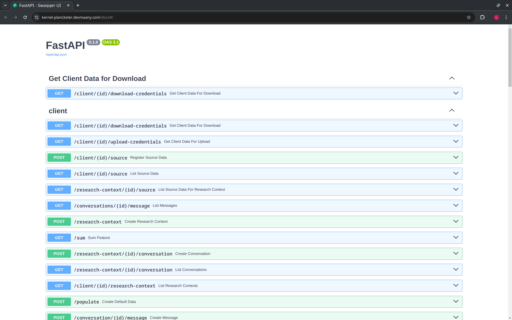
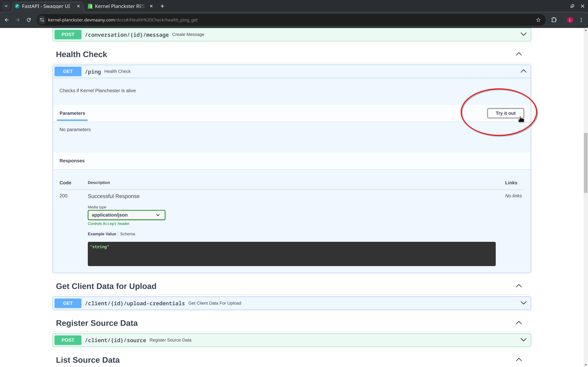
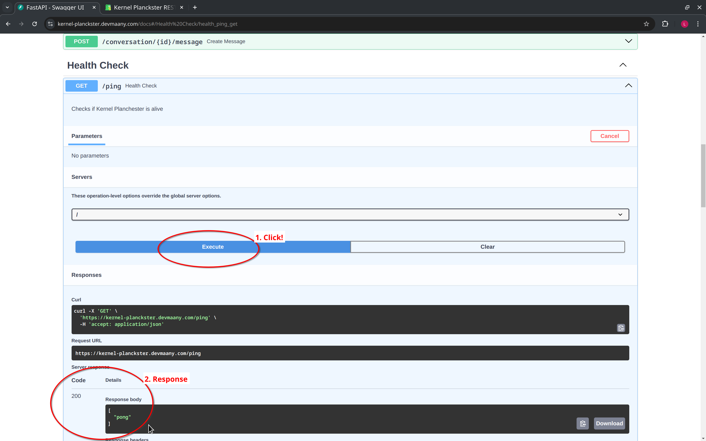
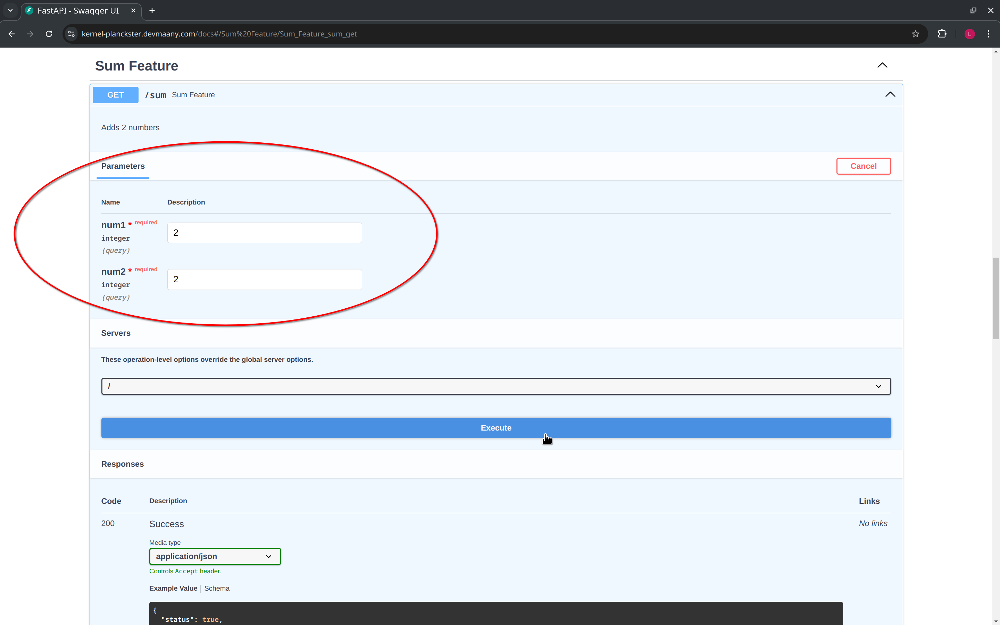
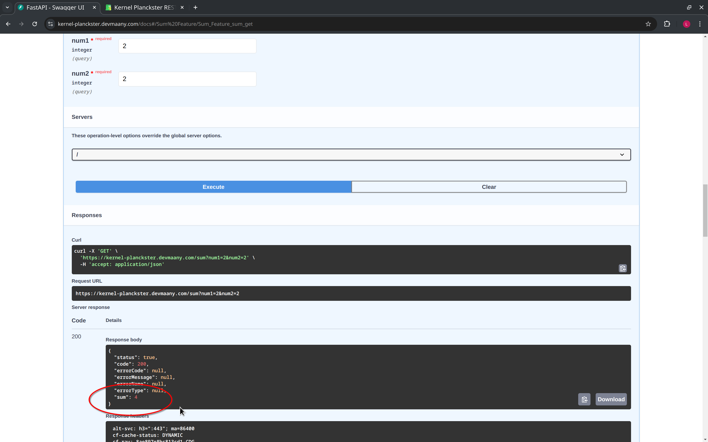
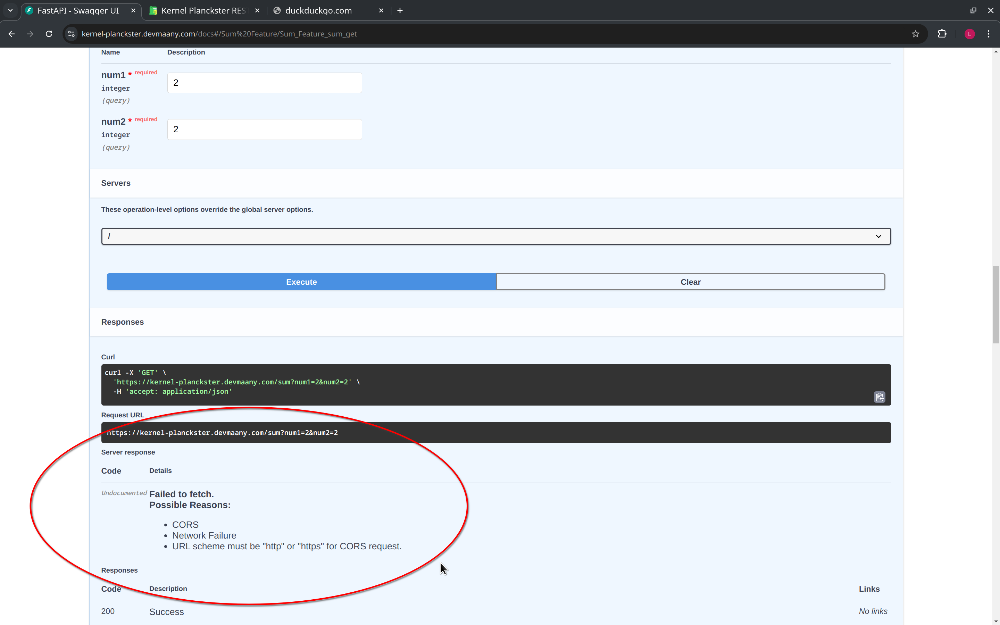
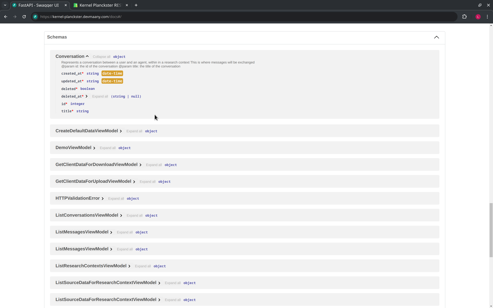
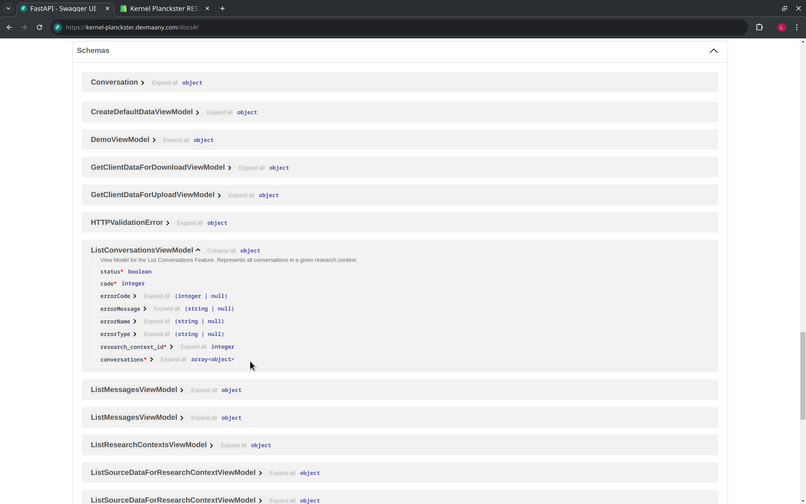

# Kernel Planckster REST API

We have set up a REST API for the Kernel Planckster.
This API allows you to interact with the Kernel Planckster using HTTP requests.
You can use this API to upload new data, download data, and perform other operations on the Kernel Planckster.

A user interface has also been set up, based on [Swagger UI](https://swagger.io/tools/swagger-ui/), to interact with this API.
This UI is reachable [at this URL](https://kernel-planckster.devmaany.com/docs#/).

Most of the activity of the Planckster Ecosystem is centralized in the Kernel, and as such, the Kernel provides basic endpoints to push the data into the ecosystem (which is, for example, what the [Scrapers](../../kubeflow/kubeflow-features-and-ui-walkthrough.md) do), and to list the available data (which is, for example, what the webserver [Websat](../../websat/websat-features-and-ui-walkthrough.md) does).

We will cover how to [upload](../upload-new-data.md) and [download](../download-data.md) using Kernel Planckster's API in the dedicated guides, so in this guide, we will cover the endpoints that allow us to (i) check that Kernel Planckster is available to use, (ii) list database entries for the different tables available, which map one-to-one to our [core concepts](../../../concepts/core-concepts/index.md) (i.e., there's one database table per core concept), and (iii) create new instances of our core concepts.


## Basic Usage of Swagger UI and Kernel Planckster Checks

The swagger UI provides a list of all available endpoints and their descriptions:



If we scroll down, we find a [health check endpoint](https://kernel-planckster.devmaany.com/docs#/Health%20Check/health_ping_get) that can be used to check the status of the Kernel Planckster.
In general, to interact with any of the endpoints, we first expand the endpoint, and then click on the "Try it out" button:



Then we click the "Execute" button to send the request, and the response will be displayed below.
Conventionally, a healthcheck endpoint may have the `/ping` URL path, and the response from the server will be a simple "pong" message.
That is, if the Kernel Plackster server is up and running, it will respond with a "pong" message when using this endpoint:

```
[
  "pong"
]
```


A more substantial check can be performed by using the example [sum feature](https://kernel-planckster.devmaany.com/docs#/Sum%20Feature/Sum_Feature_sum_get), which will return the sum of two numbers.
This feature also illustrate how to input parameters into a request.
To do this, we click on the "Try it out" button, fill the required parameters, and click on "Execute":



If Kernel Planckster is running, it will return the expected response:




### Errors

If for some reason Kernel Planckster cannot be reached but Swagger UI is still up, you will get an error response.
In this case, an error was triggered on purpose by disabling Internet connection:



However, if everything is down, then the link for Kernel Planckster will be broken and you will not even see the Swagger UI.


## Create/Register and List Endpoints

We can create new instances of any of our core concepts in Kernel Planckster's database using its API, except for `Client`, as this feature is not available at the time of writing this guide.
That is, for example, using Kernel Planckster's API we can register `Source Data`, create new `Research Context` and `Conversation` instances, and even create new `Message` instances in the database (although this will not generate any LLM response, as that functionality is triggered by [Websat](../../websat/websat-features-and-ui-walkthrough.md)).

Once we have instances of our core concepts in Kernel Planckster's database, we can list them with the "list" class of endpoints, by providing the input parameters required by the endpoint.


## Schemas

Finally, scrolling down further takes us to the "Schemas" section of the Swagger UI.
Here we'll find all of the data types managed by Kernel Planckster, and a breakdown of their attributes with their respective types.
We note that this list also contains our core concepts, as represented in Kernel Planckster in particular:



The `View Model` concept refers to the final output of a Kernel Planckster endpoint.
That is, a view model is the data structure we will receive as an endpoint output, and as such, there is a view model per endpoint, all listed in this section of the Swagger UI.
Since an endpoint response can be a "success" or an "error", any specific view model contains optional attributes to capture relevant error information (such as an error message), to be able to provide useful context about any potential problem.
These optional error attributes are not used in case our endpoint response is a success:


