# Custom Pipelines in Kubeflow

## Creating a Pipeline Notebook:

Navigate to the "Notebooks" page of Kubeflow and press *+ New Notebook*:

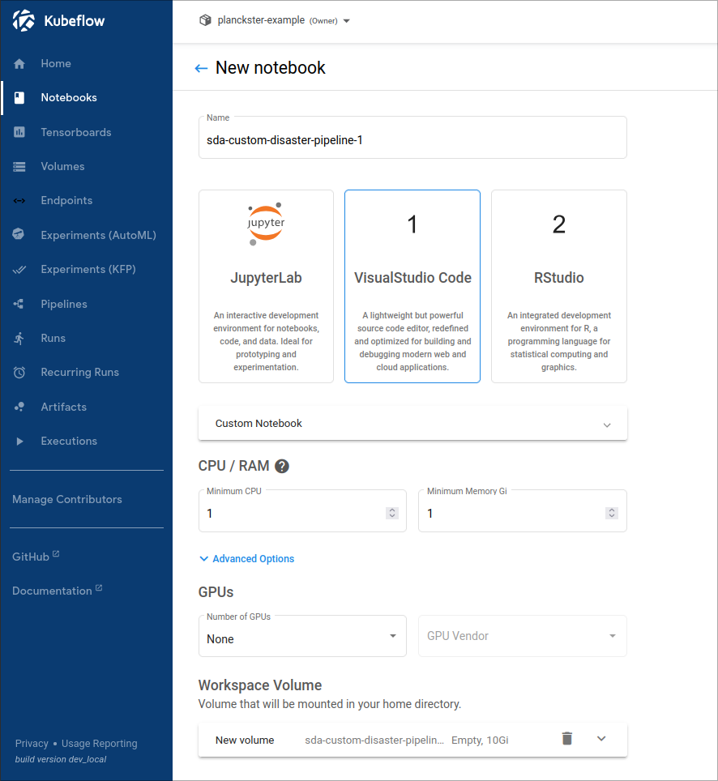

* Select a descriptive name for the notebook
* Select VisualStudio Code as the editor for the notebook
* Select an appropriate amount of CPU and RAM for the pipeline
* Add more storage to the volume if needed

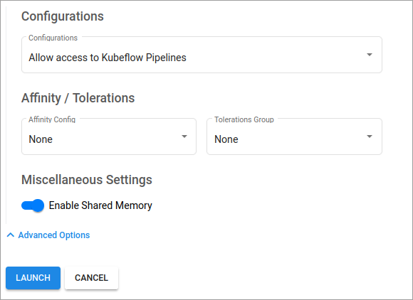

* Check **Allow access to Kubeflow Pipelines** in the *Configurations* dropdown. This step is critical to allow this notebook to create a new (custom) pipeline. 
* Click *Launch*


## Create a new DAG with existing pipeline elements:

### Create and setup the .ipynb Notebook:

```
!pip install kfp==1.8.22
import kfp
from kfp import compiler, dsl

kfp.Client() # this can be used to test if the connection is successful
```

Note: We use kfp version 1.8.22 throughout our entire Kubeflow instance, Compatibility >2.0.0 versions will arrive in v3. 

#### Example:
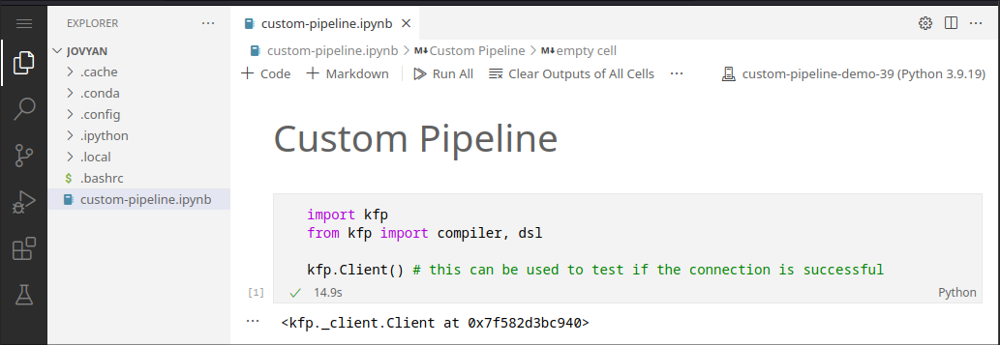

* Create a new .ipynb notebook within the home folder of the default user (Jovyan)
* Select a python kernel, ideally a new conda environment. 
* Install the "kfp" python package (allows connecting to Kubeflow client)

### Loading components

In general, components can be loaded and reused using the following code:

```
component = kfp.components.load_component_from_file("./component.txt")
```

#### Example:

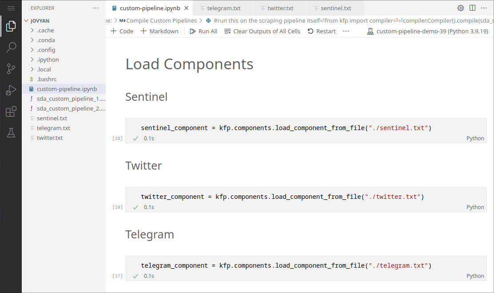

We can load the sentinel, twitter, and telegram components defined in the original *SDA-disaster-scrapers.ipynb"* notebook. This avoids having to redefine the long wrapper functions for these components. 

Note: This functionality requires components to be saved to a .txt file: see the next section

### Saving Components

In general, components can be saved with the following code after ```component_wrapper``` is defined:


```
#save component
with open("./components/component.txt", "w") as text_file:
    text_file.write(func_to_component_text(component_wrapper, base_image="maany/mpi-sda-component:version"))

```

#### Example:

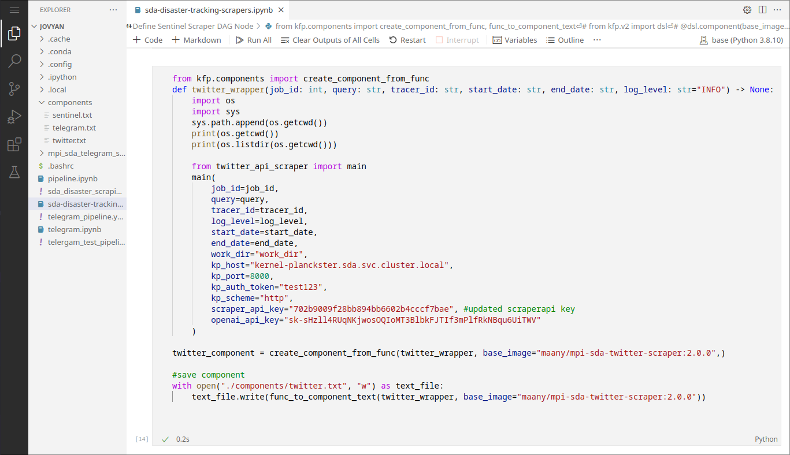


This is how we save components to .txt files in the original *sda-disaster-scrapers.ipynb* notebook.


### Assemble Custom Pipelines:

In general, custom pipelines are assembled as a set of tasks with execution options:

```
def custom_pipeline_1(INPUT PARAMETERS): # Input Parameters can be adjusted in the Kubeflow UI

    # parallel execution:
    component1_scraping_task = component1(ARGUMENTS)
    component1.execution_options.caching_strategy.max_cache_staleness = "P0D"

    component2_scraping_task = component2(ARGUMENTS)
    component2.execution_options.caching_strategy.max_cache_staleness = "P0D"
```

#### Example:

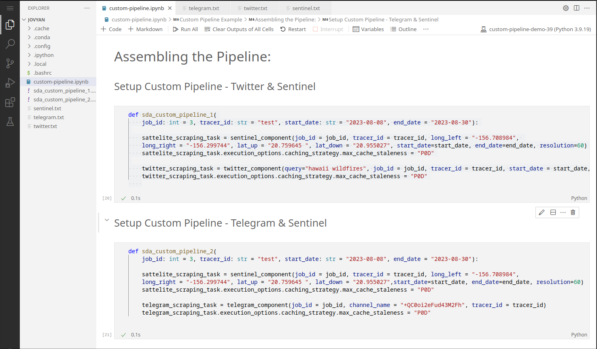

### Compile Custom Pipelines:

In general, custom pipelines are compiled to a .yaml file which is then uploaded to Kubeflow:

```
from kfp import compiler

#save the pipeline locally
compiler.Compiler().compile(custom_pipeline_1, package_path='custom_pipeline_1.yaml') 

#upload and register the pipeline with Kubeflow
kfp.Client().upload_pipeline(
    'custom_pipeline_1.yaml',
    pipeline_name="custom_pipeline_1-VERSION",
)

```

#### Example

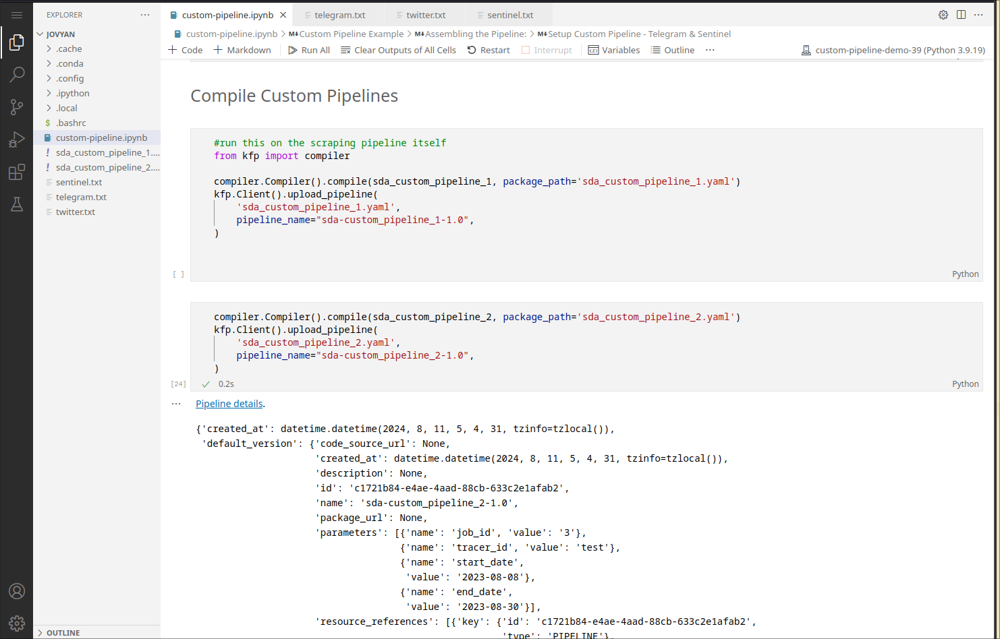

Note that a pipeline can only be uploaded *once* with the same version. To reupload, bump up the version number in the *pipeline_name* option when compiling. 


## Create a run for the pipeline:

First, navigate to the Pipelines page:

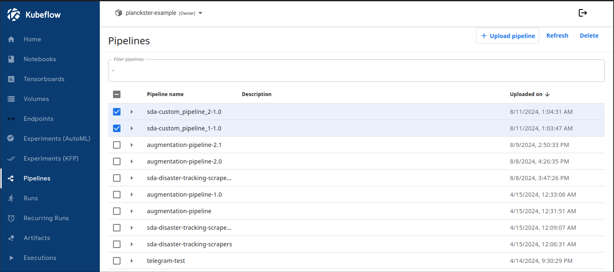

Click on a custom pipeline and select *+ Create run*

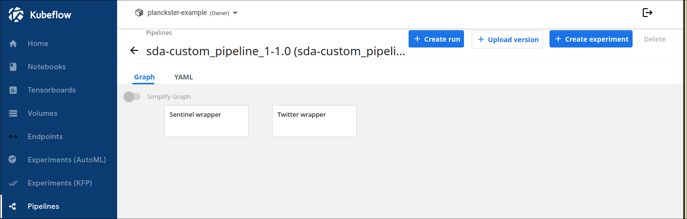

Configure the run:

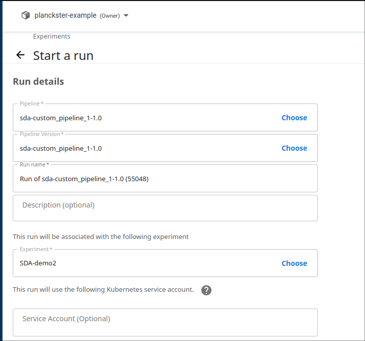
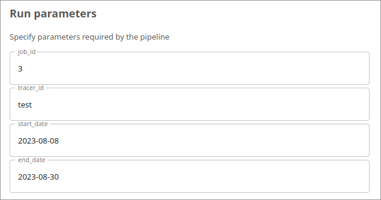

* Leave pipeline name, version, and run name as default.
* Choose an experiment that is relevant to the run: this is purely organizational.
* Specify Input Parameters. Note: It's good practice to choose a new job_id every run. 

Click *Start* 

View logs:

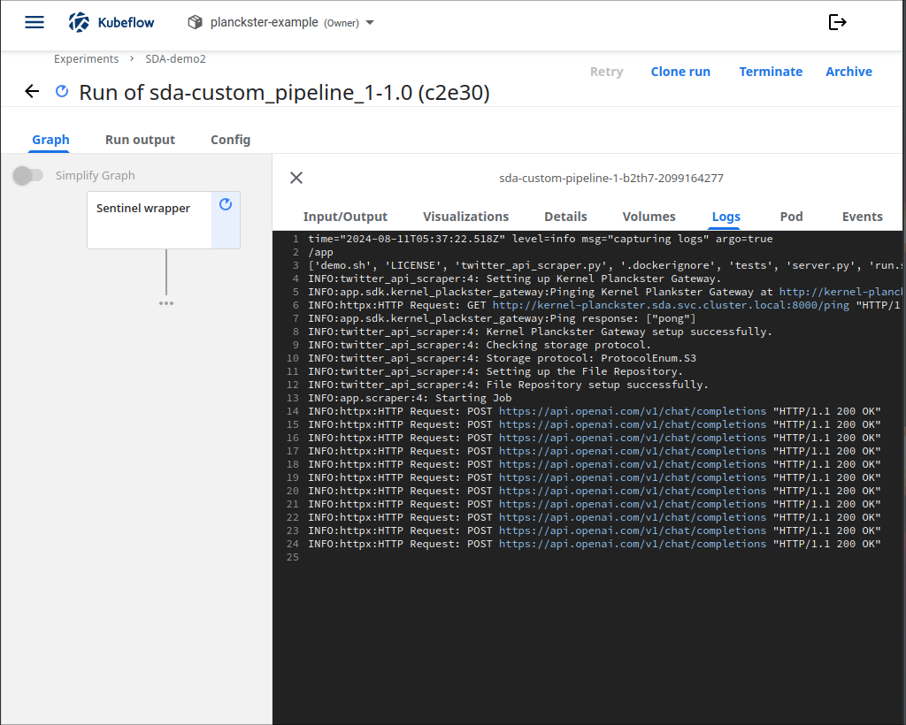

Ensure successful job completion:

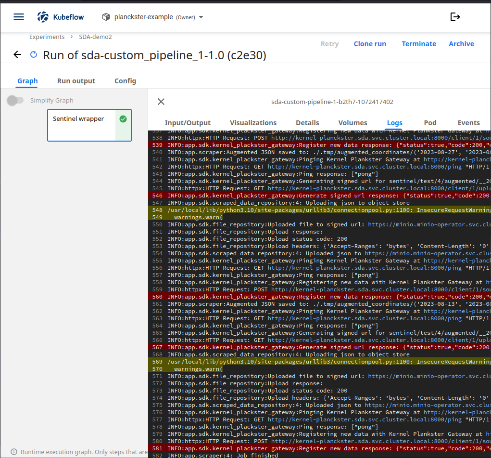

You should see the "Job finished" message at the end of the log page. Additionally, check the MinIO bucket to make sure all necessary data was uploaded.

## Conclusion

You now understand how to create and upload custom pipelines by reusing previously defined components. This is a very powerful practice that allows for rapid testing of various configurations of workflows. When paired with custom augmentation, one can even analyze the same scraper data in different ways. 