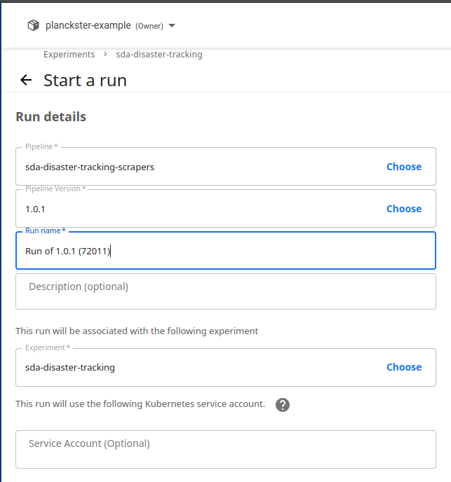
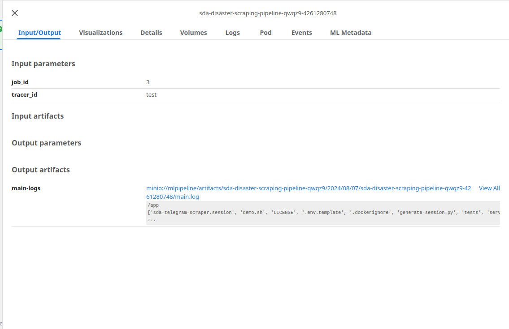
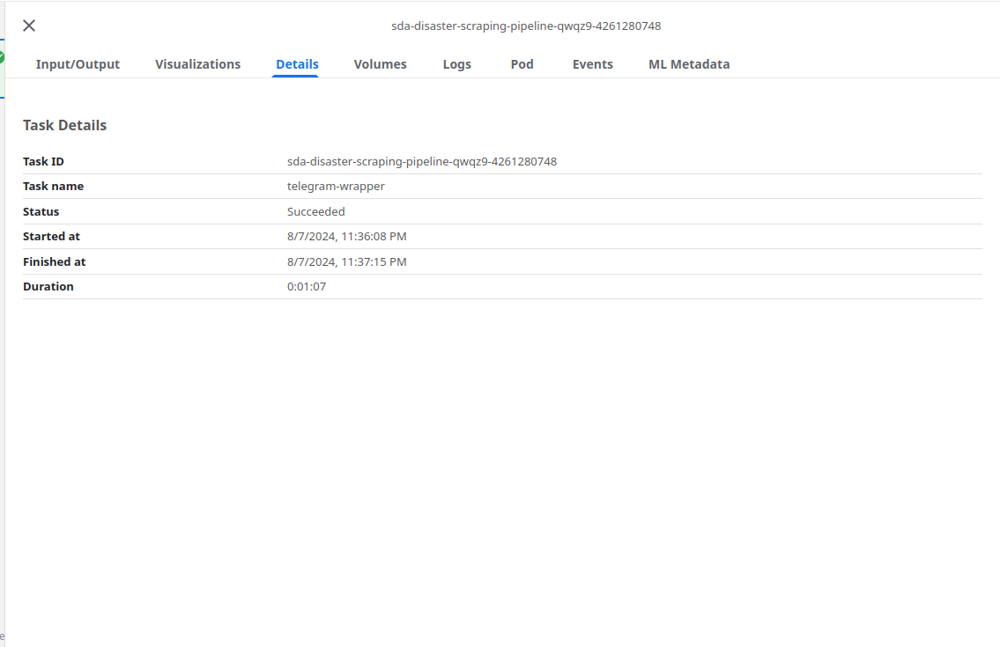
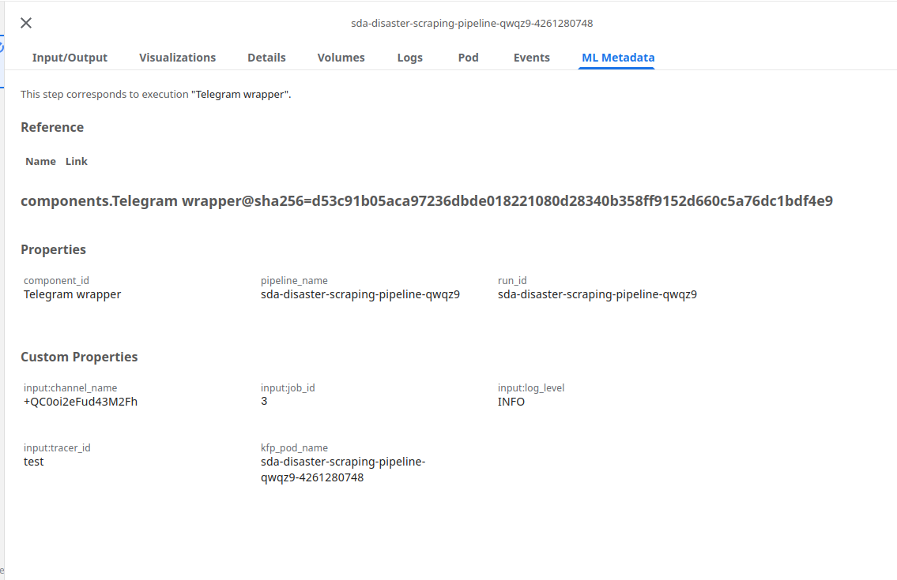

# Kubeflow Pipelines

Kubeflow Pipelines is a platform for building and deploying portable, scalable machine learning (ML) workflows based on Docker containers. It is a part of the Kubeflow project, which aims to make running ML workloads on Kubernetes simple, portable, and scalable. This guide aims to explain and demonstrate how to run a Kubeflow Pipeline.

**Note:** In Kubeflow, Pipelines are executed within the context of an Experiment. An Experiment in Kubeflow serves as a logical grouping for Pipeline runs, allowing you to track and compare multiple runs of the same Pipeline. Before running a Pipeline, you need to create or select an existing Experiment. Once the Experiment is defined, you can initiate Pipeline runs under it. This structure helps organize and manage your ML workflows more effectively.

### What is a Pipeline?

In Kubeflow, a pipeline is a sequence of steps or components that automate and orchestrate the workflow for machine learning (ML) tasks. Each step in the pipeline typically performs a specific operation, such as data preprocessing, model training, or evaluation. The pipeline is defined using a Python SDK, and it is executed within the Kubeflow environment to facilitate the reproducibility, scalability, and management of ML workflows.

- A pipeline is defined as a Directed Acyclic Graph (DAG) using the Kubeflow Pipelines SDK. Each node in the DAG represents a step in the workflow.

- Pipelines can accept parameters that allow users to customize the execution of the pipeline without modifying the pipeline code. This makes pipelines more flexible and reusable.

- Kubeflow Pipelines track the input, output, and intermediate artifacts of each step, as well as the metadata associated with pipeline runs. This helps in monitoring, debugging, and reproducing pipeline runs.

## How to run a Pipeline in Kubeflow?

### Step 1: Access Kubeflow Pipelines UI
1. Open your web browser and navigate to the Kubeflow Pipelines UI. This URL is typically provided by your Kubeflow installation.

### Step 2: Upload the Pipeline
1. **Navigate to Pipelines**:
   - In the Kubeflow Pipelines UI, click on the "Pipelines" tab in the left-hand menu.

2. **Upload Pipeline**:
   - Click the "Upload pipeline" button.
   - In the "Upload pipeline" dialog, you can either upload a new pipeline or import a pipeline from a URL. For uploading a new pipeline, click "Upload a file" and select your compiled pipeline file (ex: `scraper_pipeline.zip`).

3. **Provide Details**:
   - Enter a name and description for your pipeline.
   - Click "Upload" to upload the pipeline.

### Step 3: Create an Experiment
1. **Navigate to Experiments**:
   - Click on the "Experiments" tab in the left-hand menu.

2. **Create New Experiment**:
   - Click the "Create an experiment" button.
   - Enter a name and optional description for your experiment.
   - Click "Next" to create the experiment.

### Step 4: Run the Pipeline
1. **Navigate to the Experiment**:
   - In the Experiments tab, click on the name of the experiment you just created.

2. **Start a New Run**:
   - Within the experiment page, click the "Create run" button.

3. **Configure the Run**:
   - **Run name**: Enter a name for your run.
   - **Pipeline**: Choose the pipeline you uploaded earlier.
   - **Version**: If your pipeline has multiple versions, select the appropriate one.

   
   

4. **Start the Run**:
   - If your pipeline requires parameters, you can set them here.
   - Click the "Start" button to start the run.

   

### Step 5: Monitor the Run
1. **View Runs**:
   - After starting the run, you will be redirected to the run details page.
   - You can monitor the progress of your pipeline run in real-time. The page will show the pipeline graph, the status of each step, and logs for debugging if something goes wrong.

   

2. **Visualize Outputs**:
   - Once the run is complete, you can inspect the following:
     - **Outputs**: 
       
     - **Details**: 
       
     - **Associated Metadata**: 
       
   